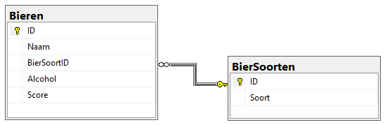
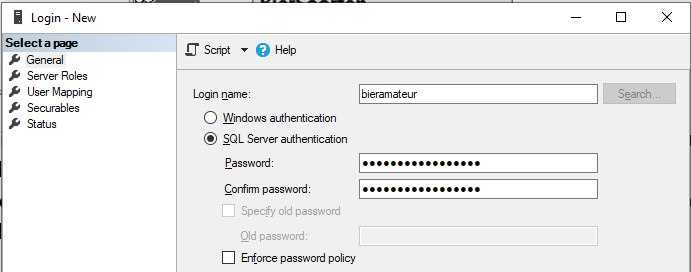
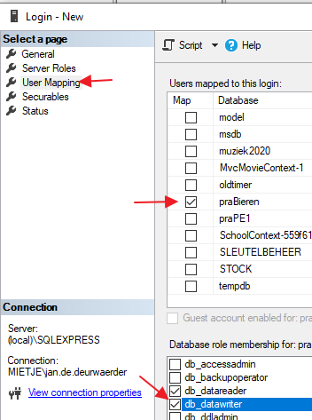
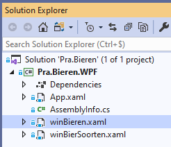
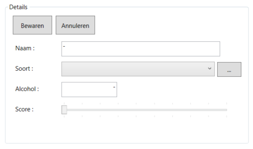

# Oefening databases connected: bieren

## Voorbereiding

> :information_source: **Alternatief:** In de submap script kan je ook een script terugvinden die de database voor jou gaat aanmaken    
> :warning: **Belangrijk:** respecteer op SQL server de precieze naamgevingen die hieronder gebruikt worden!

Maak op je eigen lokale SQL server een databank aan met de naam **praBieren**. De database **praBieren** moet 2 tabellen hebben:
- **Bieren**
  - **ID**, int, autonummering, **primaire sleutel**
  - **Naam**, nvarchar(50), vereist
  - **BierSoortID**, int, vereist
  - **Alcohol**, real
  - **Score**, int
- **BierSoorten**
  - **ID**, int, autonummering, **primaire sleutel**
  - **Soort**, nvarchar(50), vereist

Via het database diagram kan je een relatie definiëren tussen **BierSoorten.ID** en **Bieren.BierSoortID**. Weet uiteraard dat **Bieren.BierSoortID** een "foreign key" is die verwijst naar de primaire sleutel **BierSoorten.ID**.

Maak via security (onder databases) een nieuwe gebruiker aan: **bieramateur**. Geef deze het paswoord: **komMaarEensBinnen**. Vink de optie "Enforce password policy" uit.

In hetzelfde venster, maar onder **User Mapping** zorg je ervoor dat deze gebruiker de rechten **db_datareader** en **db_datawriter** krijgt voor de databank **praBieren**.

> Geen idee hoe je dit allemaal moet doen? Bekijk dan eerst even deze instructievideo: https://howest.cloud.panopto.eu/Panopto/Pages/Viewer.aspx?id=1ca4766a-d8d4-41d3-ad05-abb4009e0bf4.

## De opdracht

In de solution is reeds 1 project aanwezig met de naam **Pra.Bieren.WPF**. Hierin zijn twee WPF vensters aanwezig: **winBieren** en **winBierSoorten**. In beide WPF vensters zijn alle controls reeds aangebracht. Je dient wel zelf nog te zorgen voor de aanmaak van de nodige event-handlers, globale variabelen, methoden, ...

Wanneer je de applicatie opstart, wordt enkel het venster **winBieren** getoond. Ter info: dit werd ingesteld via het attribuut `StartupUri="winBieren.xaml"` in **App.xaml**. 

Het is de bedoeling dat je de twee tabellen uit je database **praBieren** gaat beheren in deze applicatie. Zowel voor de tabel **Bieren** als voor de tabel **BierSoorten** geldt dat ALLE velden dienen ingevuld te worden (met een niet lege string) vooraleer je een record kunt toevoegen of wijzigen.

Je zorgt er eveneens voor dat een record uit de tabel **BierSoorten** niet verwijderd kan worden indien het nog in gebruik is in de tabel **Bieren**.

Let op de twee numerieke velden (die beiden waarde 0 mogen hebben):
- **alcohol** als gebroken getal met 2 cijfers na de komma
- **score** als geheel getal

Het venster met de biersoorten dient geopend te worden wanneer je op de knop met de drie puntjes "..." klikt naast de combobox om een biersoort te selecteren. Op die manier kan je in deze "popup" nieuwe biersoorten aanmaken, een biersoort wijzigen, ... en die dan vervolgens aanduiden in de combobox voor je geselecteerde bier. Uiteraard wil dit zeggen dat de inhoud van de combobox zich telkens moet aanpassen zodra je een biersoort toegevoegd, verwijderd, of aangepast hebt!

### Connection string

In je connection string maak je gebruik van de aangemaakte gebruiker **bieramateur** en het bijhorende paswoord **komMaarEensBinnen**. Je maakt m.a.w. geen gebruik van de *integrated security*. Een voorbeeld hiervan vind je in de cursus in paragraaf 3.

### Entities en services

**Voor deze opdracht maak je gebruik van *entity* en *service* klassen, zoals besproken in paragraaf 10 in de cursus.** Je stopt deze uiteraard in een class library en geeft die de naam **Pra.Bieren.Core**. Hierin voorzie je twee mappen:

- Entities
- Services

De entity en service klassen plaats je dan telkens in de bijhorende map. Zorg zelf voor de nodige referenties tussen projecten binnen de solution.

**In je WPF project zit geen enkele verwijzing naar het "database gebeuren". Je werkt m.a.w. NIET met DataSets of DataTables maar met je eigen entity klassen als doorgeefluik naar de presentatielaag.**

### Stored procedures

Ten slotte: hoe interessant stored procedures ook zijn, in deze oefening gebruik je ze niet. Jouw applicatie dient uiteindelijk op onze computers te kunnen werken (waar we niet beschikken over eventuele stored procedures die jij lokaal aangemaakt hebt in je database).

#### Succes!
